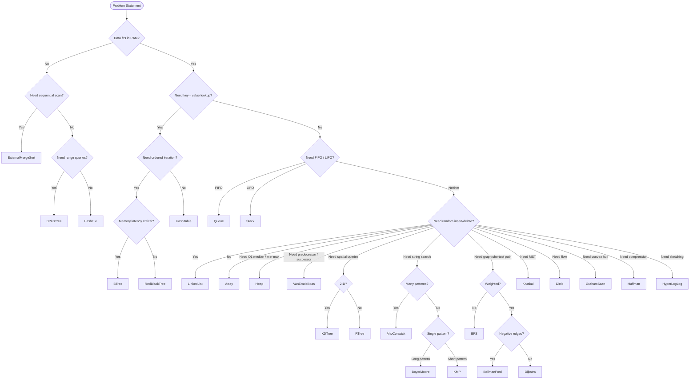

# AGENTS.md - Universal Programming Framework

## Core Philosophy

### Before Writing Any Code
1. **Always consult this AGENTS.md file** for principles and guidelines
2. **Reference the Universal Data Structure/Algorithm Chart** to select appropriate data structures
3. **Break down high-level and complex problems** into smaller tasks before combining into bigger solutions
4. **Understand the problem first**, not the solution
5. **Analyze existing patterns** in the codebase
6. **Consider edge cases and error scenarios**

---

## Universal Development Principles

### YAGNI - You Ain't Gonna Need It
- Don't build features you're not sure will be needed yet
- Start by understanding the problem, not by building the solution
- Focus on what is actually needed right now
- Avoid over-engineering and premature optimization

### WET - Write Everything Twice
- Don't create abstractions you don't need yet
- Need to solve a problem? Just solve it
- Need to solve it again? Solve it again (duplication is acceptable)
- Need to solve it a **third time**? Now refactor the existing solutions into an abstraction

### Abstraction Levels
- Keep each function/class/module at the same level of abstraction
- Business logic functions should be readable by non-developers who understand the business
- Technical functions should be readable by developers who may not know the business domain
- Don't mix different abstraction levels within the same function

---

## Testing Philosophy

### Tests Accrete Over Time
- Don't stop everything to improve low test coverage
- Write tests as you discover bugs or create new features
- Build a useful test suite gradually over time
- Delete tests that create friction without providing value

### Make Testing Easy
- Reduce friction in writing tests to increase likelihood of test creation
- Invest effort in improving the developer experience for testing
- Every bit of testing friction increases the chance tests won't be written under pressure

### At Least Write One Test
- For straightforward but verbose components, write at least one test
- This makes it easier for future developers to add more tests by following the example
- Focus on the most critical path first

### Testable Code Priority
- **It's more important for code to be testable than actually tested**
- Testable code tends to be more extensible and easier to understand
- Writing testable code improves design even without comprehensive test coverage
- Practice writing tests to develop the skill of creating testable code

### Tests as Documentation
- Tests should serve as documentation for how to use components/functions
- Developers shouldn't need to dive into implementation details to understand usage
- Tests demonstrate expected inputs, outputs, and edge cases
- Good tests make code easy to delete and replace

---

## Change Management

### Non-Breaking Changes
- Avoid changes that require fixes in multiple calling locations
- Keep old functionality and mark as deprecated
- Provide new functionality alongside deprecated versions
- Periodically review and remove unused deprecated code
- Prefer evolutionary changes over revolutionary refactors

### Good Code is Easy to Delete
- Well-designed code can be easily removed and replaced
- Isolate complex or "hairy" functions with clear interfaces
- Avoid tight coupling between components
- If code is hard to delete, it's likely poorly designed

---

## Code Quality Principles

### Pragmatism Over Perfectionism
- Don't let perfect be the enemy of good
- Ship working solutions over theoretical perfection
- Prefer practical solutions that work over elegant solutions that don't
- Balance code quality with delivery timelines

### Future Developer Consideration
- Future developers (including yourself in 6 months) will copy existing patterns
- Set good examples - others will follow your lead
- If doing something hacky, document it clearly to discourage copying
- Think about the precedent you're setting with your code choices

### Consistency and Maintainability
- Follow existing patterns in the codebase
- Use consistent naming conventions
- Apply the same formatting and style rules throughout
- Make code readable and self-documenting

---

## Universal Data Structure & Algorithm Selection

**Always analyze the problem needs using this decision flowchart before implementing:**



### Data Structure Decision Process
1. **Always tell user what the problem needs** and the flowchart path to the chosen data structure/algorithm
2. **Justify the choice** based on the specific requirements
3. **Consider performance characteristics**: time complexity, space complexity, cache efficiency
4. **Think about the data access patterns** your application will have

---

## Universal Code Quality Standards

### Accessibility (Universal Principles)
- Provide meaningful descriptions for all interactive elements
- Ensure keyboard navigation works for all interactive components
- Use semantic markup and proper element roles
- Include proper labeling and context for assistive technologies
- Test with screen readers and accessibility tools
- Follow WCAG guidelines regardless of technology stack

### Error Handling
- Always handle expected error cases explicitly
- Provide meaningful error messages for users and developers
- Don't silently swallow errors - log them appropriately
- Have a clear error handling strategy at the application level
- Consider graceful degradation for non-critical features

### Security Best Practices
- Never hardcode secrets, keys, or sensitive data
- Validate and sanitize all user inputs
- Use secure communication protocols (HTTPS, etc.)
- Implement proper authentication and authorization
- Follow the principle of least privilege
- Keep dependencies updated and audit for vulnerabilities

### Performance Considerations
- Avoid premature optimization, but don't ignore obvious inefficiencies
- Profile before optimizing - measure actual performance bottlenecks
- Consider the user experience impact of performance decisions
- Use appropriate data structures for your access patterns
- Cache wisely - understand cache invalidation strategies

### Memory Management
- Understand the memory characteristics of your chosen language/platform
- Clean up resources appropriately (close files, database connections, etc.)
- Avoid memory leaks through proper reference management
- Consider the garbage collection impact in managed languages
- Monitor memory usage in production systems

---

## Code Organization

### Separation of Concerns
- Each module/function should have a single, clear responsibility
- Separate business logic from presentation logic
- Keep data access logic separate from business rules
- Isolate external dependencies behind interfaces

### Modularity
- Create cohesive modules with low coupling
- Design clear interfaces between components
- Make dependencies explicit and manageable
- Enable easy testing through good module boundaries

### Documentation
- Code should be self-documenting through good naming and structure
- Add comments for complex business rules or unusual implementations
- Maintain API documentation for public interfaces
- Keep documentation close to the code it describes

---

## Development Workflow

### Problem Solving Approach
1. **Understand the problem** - don't jump to solutions
2. **Break complex problems** into smaller, manageable pieces
3. **Choose appropriate data structures** using the decision chart
4. **Implement incrementally** - get something working first
5. **Test early and often** - validate your assumptions
6. **Refactor when you have duplication** (third time is the charm)
7. **Document decisions** and trade-offs made

### Code Review Guidelines
- Focus on design and maintainability over style (use automated tools for style)
- Check for proper error handling and edge cases
- Verify security considerations are addressed
- Ensure tests cover the critical paths
- Look for opportunities to reduce complexity
- Confirm the solution addresses the actual problem

### Continuous Improvement
- Regularly revisit and update these principles based on team experience
- Learn from production issues and incorporate lessons into guidelines  
- Share knowledge and best practices across the team
- Invest in tools and processes that reduce developer friction
- Measure and monitor code quality metrics over time

---

## Language and Framework Agnostic Reminders

- **Start simple** - you can always add complexity later
- **Favor composition over inheritance** when building systems
- **Write code for humans to read** - computers will execute anything that parses
- **Optimize for change** - software requirements always evolve
- **Measure twice, cut once** - understand the problem before coding the solution
- **Ship working software** - iterate based on real user feedback
- **Learn from your mistakes** - conduct blameless post-mortems and improve processes

Remember: These principles apply whether you're writing JavaScript, Python, Java, C#, Go, Rust, or any other language. The specific syntax may change, but the underlying principles of good software design remain constant.

# Project Context
Ultracite enforces strict type safety, accessibility standards, and consistent code quality for JavaScript/TypeScript projects using Biome's lightning-fast formatter and linter.

## Key Principles
- Zero configuration required
- Subsecond performance
- Maximum type safety
- AI-friendly code generation

## Before Writing Code
1. Analyze existing patterns in the codebase
2. Consider edge cases and error scenarios
3. Follow the rules below strictly
4. Validate accessibility requirements

## Rules

### Accessibility (a11y)
- Don't use `accessKey` attribute on any HTML element.
- Don't set `aria-hidden="true"` on focusable elements.
- Don't add ARIA roles, states, and properties to elements that don't support them.
- Don't use distracting elements like `<marquee>` or `<blink>`.
- Only use the `scope` prop on `<th>` elements.
- Don't assign non-interactive ARIA roles to interactive HTML elements.
- Make sure label elements have text content and are associated with an input.
- Don't assign interactive ARIA roles to non-interactive HTML elements.
- Don't assign `tabIndex` to non-interactive HTML elements.
- Don't use positive integers for `tabIndex` property.
- Don't include "image", "picture", or "photo" in img alt prop.
- Don't use explicit role property that's the same as the implicit/default role.
- Make static elements with click handlers use a valid role attribute.
- Always include a `title` element for SVG elements.
- Give all elements requiring alt text meaningful information for screen readers.
- Make sure anchors have content that's accessible to screen readers.
- Assign `tabIndex` to non-interactive HTML elements with `aria-activedescendant`.
- Include all required ARIA attributes for elements with ARIA roles.
- Make sure ARIA properties are valid for the element's supported roles.
- Always include a `type` attribute for button elements.
- Make elements with interactive roles and handlers focusable.
- Give heading elements content that's accessible to screen readers (not hidden with `aria-hidden`).
- Always include a `lang` attribute on the html element.
- Always include a `title` attribute for iframe elements.
- Accompany `onClick` with at least one of: `onKeyUp`, `onKeyDown`, or `onKeyPress`.
- Accompany `onMouseOver`/`onMouseOut` with `onFocus`/`onBlur`.
- Include caption tracks for audio and video elements.
- Use semantic elements instead of role attributes in JSX.
- Make sure all anchors are valid and navigable.
- Ensure all ARIA properties (`aria-*`) are valid.
- Use valid, non-abstract ARIA roles for elements with ARIA roles.
- Use valid ARIA state and property values.
- Use valid values for the `autocomplete` attribute on input elements.
- Use correct ISO language/country codes for the `lang` attribute.

### Code Complexity and Quality
- Don't use consecutive spaces in regular expression literals.
- Don't use the `arguments` object.
- Don't use primitive type aliases or misleading types.
- Don't use the comma operator.
- Don't use empty type parameters in type aliases and interfaces.
- Don't write functions that exceed a given Cognitive Complexity score.
- Don't nest describe() blocks too deeply in test files.
- Don't use unnecessary boolean casts.
- Don't use unnecessary callbacks with flatMap.
- Use for...of statements instead of Array.forEach.
- Don't create classes that only have static members (like a static namespace).
- Don't use this and super in static contexts.
- Don't use unnecessary catch clauses.
- Don't use unnecessary constructors.
- Don't use unnecessary continue statements.
- Don't export empty modules that don't change anything.
- Don't use unnecessary escape sequences in regular expression literals.
- Don't use unnecessary fragments.
- Don't use unnecessary labels.
- Don't use unnecessary nested block statements.
- Don't rename imports, exports, and destructured assignments to the same name.
- Don't use unnecessary string or template literal concatenation.
- Don't use String.raw in template literals when there are no escape sequences.
- Don't use useless case statements in switch statements.
- Don't use ternary operators when simpler alternatives exist.
- Don't use useless `this` aliasing.
- Don't use any or unknown as type constraints.
- Don't initialize variables to undefined.
- Don't use the void operators (they're not familiar).
- Use arrow functions instead of function expressions.
- Use Date.now() to get milliseconds since the Unix Epoch.
- Use .flatMap() instead of map().flat() when possible.
- Use literal property access instead of computed property access.
- Don't use parseInt() or Number.parseInt() when binary, octal, or hexadecimal literals work.
- Use concise optional chaining instead of chained logical expressions.
- Use regular expression literals instead of the RegExp constructor when possible.
- Don't use number literal object member names that aren't base 10 or use underscore separators.
- Remove redundant terms from logical expressions.
- Use while loops instead of for loops when you don't need initializer and update expressions.
- Don't pass children as props.
- Don't reassign const variables.
- Don't use constant expressions in conditions.
- Don't use `Math.min` and `Math.max` to clamp values when the result is constant.
- Don't return a value from a constructor.
- Don't use empty character classes in regular expression literals.
- Don't use empty destructuring patterns.
- Don't call global object properties as functions.
- Don't declare functions and vars that are accessible outside their block.
- Make sure builtins are correctly instantiated.
- Don't use super() incorrectly inside classes. Also check that super() is called in classes that extend other constructors.
- Don't use variables and function parameters before they're declared.
- Don't use 8 and 9 escape sequences in string literals.
- Don't use literal numbers that lose precision.

### React and JSX Best Practices
- Don't use the return value of React.render.
- Make sure all dependencies are correctly specified in React hooks.
- Make sure all React hooks are called from the top level of component functions.
- Don't forget key props in iterators and collection literals.
- Don't destructure props inside JSX components in Solid projects.
- Don't define React components inside other components.
- Don't use event handlers on non-interactive elements.
- Don't assign to React component props.
- Don't use both `children` and `dangerouslySetInnerHTML` props on the same element.
- Don't use dangerous JSX props.
- Don't use Array index in keys.
- Don't insert comments as text nodes.
- Don't assign JSX properties multiple times.
- Don't add extra closing tags for components without children.
- Use `<>...</>` instead of `<Fragment>...</Fragment>`.
- Watch out for possible "wrong" semicolons inside JSX elements.

### Correctness and Safety
- Don't assign a value to itself.
- Don't return a value from a setter.
- Don't compare expressions that modify string case with non-compliant values.
- Don't use lexical declarations in switch clauses.
- Don't use variables that haven't been declared in the document.
- Don't write unreachable code.
- Make sure super() is called exactly once on every code path in a class constructor before this is accessed if the class has a superclass.
- Don't use control flow statements in finally blocks.
- Don't use optional chaining where undefined values aren't allowed.
- Don't have unused function parameters.
- Don't have unused imports.
- Don't have unused labels.
- Don't have unused private class members.
- Don't have unused variables.
- Make sure void (self-closing) elements don't have children.
- Don't return a value from a function with the return type 'void'
- Use isNaN() when checking for NaN.
- Make sure "for" loop update clauses move the counter in the right direction.
- Make sure typeof expressions are compared to valid values.
- Make sure generator functions contain yield.
- Don't use await inside loops.
- Don't use bitwise operators.
- Don't use expressions where the operation doesn't change the value.
- Make sure Promise-like statements are handled appropriately.
- Don't use __dirname and __filename in the global scope.
- Prevent import cycles.
- Don't use configured elements.
- Don't hardcode sensitive data like API keys and tokens.
- Don't let variable declarations shadow variables from outer scopes.
- Don't use the TypeScript directive @ts-ignore.
- Prevent duplicate polyfills from Polyfill.io.
- Don't use useless backreferences in regular expressions that always match empty strings.
- Don't use unnecessary escapes in string literals.
- Don't use useless undefined.
- Make sure getters and setters for the same property are next to each other in class and object definitions.
- Make sure object literals are declared consistently (defaults to explicit definitions).
- Use static Response methods instead of new Response() constructor when possible.
- Make sure switch-case statements are exhaustive.
- Make sure the `preconnect` attribute is used when using Google Fonts.
- Use `Array#{indexOf,lastIndexOf}()` instead of `Array#{findIndex,findLastIndex}()` when looking for the index of an item.
- Make sure iterable callbacks return consistent values.
- Use `with { type: "json" }` for JSON module imports.
- Use numeric separators in numeric literals.
- Use object spread instead of `Object.assign()` when constructing new objects.
- Always use the radix argument when using `parseInt()`.
- Make sure JSDoc comment lines start with a single asterisk, except for the first one.
- Include a description parameter for `Symbol()`.
- Don't use spread (`...`) syntax on accumulators.
- Don't use the `delete` operator.
- Don't access namespace imports dynamically.
- Don't use namespace imports.
- Declare regex literals at the top level.
- Don't use `target="_blank"` without `rel="noopener"`.

### TypeScript Best Practices
- Don't use TypeScript enums.
- Don't export imported variables.
- Don't add type annotations to variables, parameters, and class properties that are initialized with literal expressions.
- Don't use TypeScript namespaces.
- Don't use non-null assertions with the `!` postfix operator.
- Don't use parameter properties in class constructors.
- Don't use user-defined types.
- Use `as const` instead of literal types and type annotations.
- Use either `T[]` or `Array<T>` consistently.
- Initialize each enum member value explicitly.
- Use `export type` for types.
- Use `import type` for types.
- Make sure all enum members are literal values.
- Don't use TypeScript const enum.
- Don't declare empty interfaces.
- Don't let variables evolve into any type through reassignments.
- Don't use the any type.
- Don't misuse the non-null assertion operator (!) in TypeScript files.
- Don't use implicit any type on variable declarations.
- Don't merge interfaces and classes unsafely.
- Don't use overload signatures that aren't next to each other.
- Use the namespace keyword instead of the module keyword to declare TypeScript namespaces.

### Style and Consistency
- Don't use global `eval()`.
- Don't use callbacks in asynchronous tests and hooks.
- Don't use negation in `if` statements that have `else` clauses.
- Don't use nested ternary expressions.
- Don't reassign function parameters.
- This rule lets you specify global variable names you don't want to use in your application.
- Don't use specified modules when loaded by import or require.
- Don't use constants whose value is the upper-case version of their name.
- Use `String.slice()` instead of `String.substr()` and `String.substring()`.
- Don't use template literals if you don't need interpolation or special-character handling.
- Don't use `else` blocks when the `if` block breaks early.
- Don't use yoda expressions.
- Don't use Array constructors.
- Use `at()` instead of integer index access.
- Follow curly brace conventions.
- Use `else if` instead of nested `if` statements in `else` clauses.
- Use single `if` statements instead of nested `if` clauses.
- Use `new` for all builtins except `String`, `Number`, and `Boolean`.
- Use consistent accessibility modifiers on class properties and methods.
- Use `const` declarations for variables that are only assigned once.
- Put default function parameters and optional function parameters last.
- Include a `default` clause in switch statements.
- Use the `**` operator instead of `Math.pow`.
- Use `for-of` loops when you need the index to extract an item from the iterated array.
- Use `node:assert/strict` over `node:assert`.
- Use the `node:` protocol for Node.js builtin modules.
- Use Number properties instead of global ones.
- Use assignment operator shorthand where possible.
- Use function types instead of object types with call signatures.
- Use template literals over string concatenation.
- Use `new` when throwing an error.
- Don't throw non-Error values.
- Use `String.trimStart()` and `String.trimEnd()` over `String.trimLeft()` and `String.trimRight()`.
- Use standard constants instead of approximated literals.
- Don't assign values in expressions.
- Don't use async functions as Promise executors.
- Don't reassign exceptions in catch clauses.
- Don't reassign class members.
- Don't compare against -0.
- Don't use labeled statements that aren't loops.
- Don't use void type outside of generic or return types.
- Don't use console.
- Don't use control characters and escape sequences that match control characters in regular expression literals.
- Don't use debugger.
- Don't assign directly to document.cookie.
- Use `===` and `!==`.
- Don't use duplicate case labels.
- Don't use duplicate class members.
- Don't use duplicate conditions in if-else-if chains.
- Don't use two keys with the same name inside objects.
- Don't use duplicate function parameter names.
- Don't have duplicate hooks in describe blocks.
- Don't use empty block statements and static blocks.
- Don't let switch clauses fall through.
- Don't reassign function declarations.
- Don't allow assignments to native objects and read-only global variables.
- Use Number.isFinite instead of global isFinite.
- Use Number.isNaN instead of global isNaN.
- Don't assign to imported bindings.
- Don't use irregular whitespace characters.
- Don't use labels that share a name with a variable.
- Don't use characters made with multiple code points in character class syntax.
- Make sure to use new and constructor properly.
- Don't use shorthand assign when the variable appears on both sides.
- Don't use octal escape sequences in string literals.
- Don't use Object.prototype builtins directly.
- Don't redeclare variables, functions, classes, and types in the same scope.
- Don't have redundant "use strict".
- Don't compare things where both sides are exactly the same.
- Don't let identifiers shadow restricted names.
- Don't use sparse arrays (arrays with holes).
- Don't use template literal placeholder syntax in regular strings.
- Don't use the then property.
- Don't use unsafe negation.
- Don't use var.
- Don't use with statements in non-strict contexts.
- Make sure async functions actually use await.
- Make sure default clauses in switch statements come last.
- Make sure to pass a message value when creating a built-in error.
- Make sure get methods always return a value.
- Use a recommended display strategy with Google Fonts.
- Make sure for-in loops include an if statement.
- Use Array.isArray() instead of instanceof Array.
- Make sure to use the digits argument with Number#toFixed().
- Make sure to use the "use strict" directive in script files.

### Next.js Specific Rules
- Don't use `` elements in Next.js projects.
- Don't use `<head>` elements in Next.js projects.
- Don't import next/document outside of pages/_document.jsx in Next.js projects.
- Don't use the next/head module in pages/_document.js on Next.js projects.

### Testing Best Practices
- Don't use export or module.exports in test files.
- Don't use focused tests.
- Make sure the assertion function, like expect, is placed inside an it() function call.
- Don't use disabled tests.

## Example: Error Handling
```typescript
// ✅ Good: Comprehensive error handling
try {
  const result = await fetchData();
  return { success: true, data: result };
} catch (error) {
  console.error('API call failed:', error);
  return { success: false, error: error.message };
}

// ❌ Bad: Swallowing errors
try {
  return await fetchData();
} catch (e) {
  console.log(e);
}
```